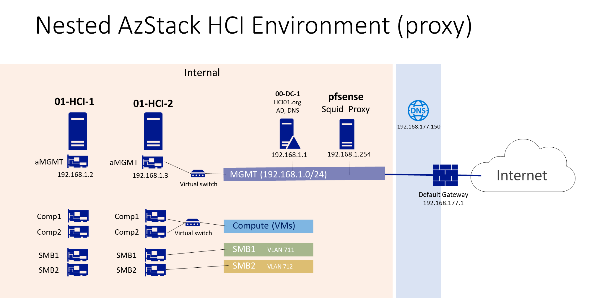

# Installing Azure Stack HCI 23h2 with a Proxy

## This is how the environment looks like

## Watch it done on YT

## Artefacts in this code repo
- [my Squid proxy log, filtered URL list + deployment steps and timestamps for reference with URLs, DNS, FQDNs being used.](23H2ProxyDeployment_12-07-2024.xlsx)  
 
| deployment steps | squid log | filtered FQDNs |
|--|--|--|
| | | |

- [SetProxy.ps1 - PScript sample to do proxy settings on each HCI node prio deployment](SetProxy.ps1)
- [ArcRegisterWithProxy.ps1 - PScript sample to register each HCI node in Azure via a proxy](ArcRegisterWithProxy.ps1) 

## Additional Resources
- [Configure proxy settings for Azure Stack HCI, version 23H2](https://learn.microsoft.com/en-us/azure-stack/hci/manage/configure-proxy-settings-23h2)
- [Required firewall URLs for Azure Stack HCI 23H2 deployments](https://learn.microsoft.com/en-us/azure-stack/hci/concepts/firewall-requirements#required-firewall-urls-for-azure-stack-hci-23h2-deployments)
- [About Azure Stack HCI, version 23H2 deployment](https://learn.microsoft.com/en-us/azure-stack/hci/deploy/deployment-introduction)
- [Used this (modified) for creating my demo environment](https://github.com/bfrankMS/CreateHypervVms/tree/master/Scenario-AzStackHCI)
